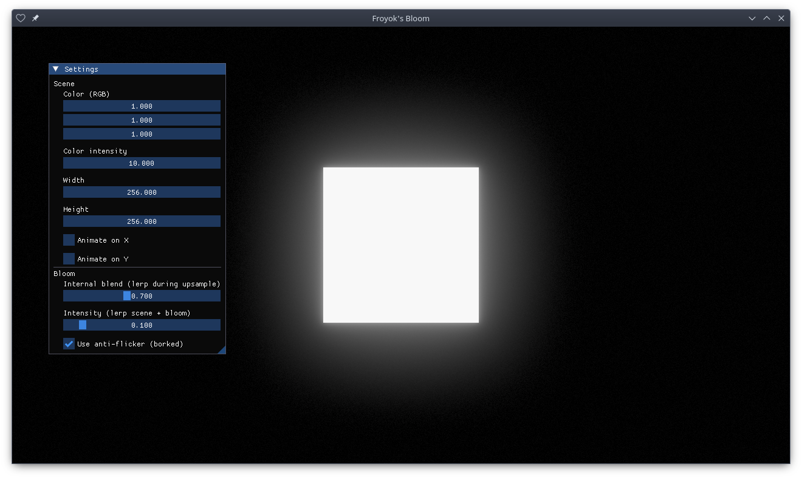

# Bloom
Implementation of realtime bloom post-process.

- Based on: https://www.froyok.fr/blog/2021-12-ue4-custom-bloom/
- Use [Löve](https://github.com/love2d/love) (version 12, pre-release) with OpenGL backend by default.
- Use [cimgui-love](https://codeberg.org/apicici/cimgui-love).
- Use [Tony McMapface](https://github.com/h3r2tic/tony-mc-mapface) for display mapping (HDR to SDR).

## How to run

### Windows

1. Launch `run.bat`

### Linux

1. Run `chmod +x bin/12/linux/bin/love`
2. Run `chmod +x run.sh`
3. Run `./run.sh`

## Screenshot

